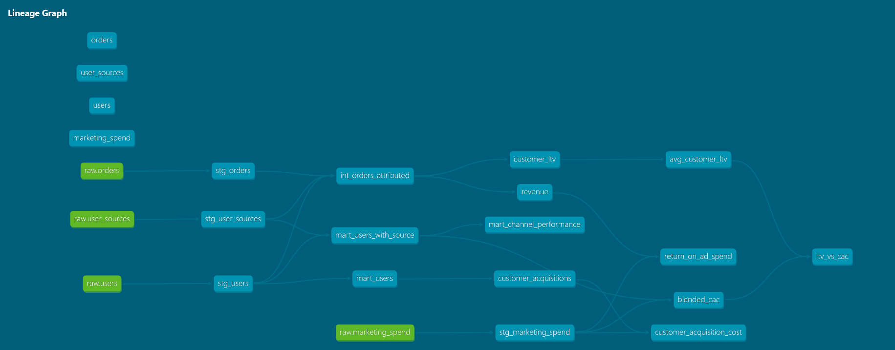
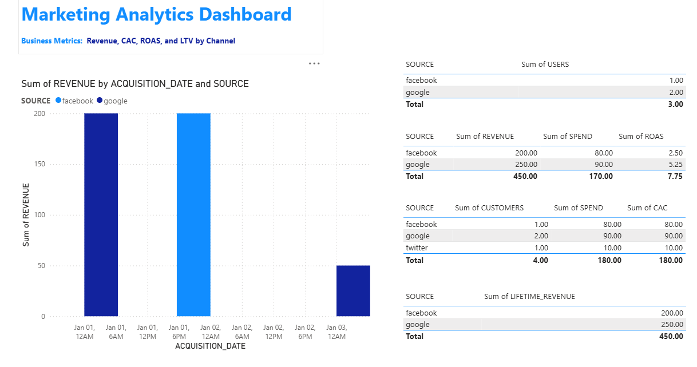

# Marketing Analytics Engineering Platform

## Overview
This project demonstrates an end-to-end **marketing analytics engineering workflow**, transforming raw marketing and transactional data into analytics-ready models and business metrics.

It reflects a real-world analytics stack used by growth, marketing, and finance teams to evaluate performance, attribution, and ROI.

The project is implemented using **dbt Core** and follows analytics engineering best practices including layered modeling, data quality testing, and metric standardization.

---

## Key Features
- End-to-end marketing analytics pipeline
- dbt-based transformation layer (RAW → staging → intermediate → marts)
- Business-ready metrics such as CAC, ROAS, and LTV
- Data quality and integrity testing
- Analytics-ready fact and dimension tables
- Example BI dashboard for stakeholder consumption

---

## Tech Stack
- **Data Warehouse:** Snowflake
- **Transformation:** dbt Core
- **Ingestion (Production):** Supabase → Fivetran
- **Modeling:** Dimensional (facts & dimensions)
- **Visualization:** BI dashboard (sample output included)
- **Development Mode:** Local execution (dbt Core)


---

## Architecture
```text
Supabase (Application Data)
            ↓
        Fivetran (ELT)
            ↓
        Snowflake (PUBLIC / RAW)
            ↓
          dbt Core
  (staging → intermediate → marts)
            ↓
       BI / Analytics Layer
```

For local development and reproducibility, the project also supports dbt seeds as a fallback data source when ingestion tooling (e.g., Fivetran trial) is unavailable.

---

## dbt Lineage

The following lineage graph, generated using dbt docs, illustrates how raw source data flows through staging, intermediate, and mart layers to produce analytics-ready tables and business metrics.



---

## Project Structure
```text
models/
├── staging/
├── intermediate/
├── marts/
seeds/
├── raw/	
```

---

## Layering Principles
- **RAW:** Analytics contract over ingested data
- **Staging:** One-to-one with source tables, minimal logic
- **Intermediate:** Shared transformations and joins
- **Marts:** Business metrics optimized for analytics and BI

---

## Local Development Setup
This project runs locally using **dbt Core**.

Two execution modes are supported:
- **Production-like:** Supabase → Fivetran → Snowflake
- **Local / Demo:** dbt seeds (no external ingestion required)

Environment variables can be configured using the provided `.env.example` file.

---

## Prerequisites
- Python 3.9+
- Snowflake account
- pip

---

## Step 1: Install dbt
```bash
pip install dbt-snowflake
```

---

## Step 2: Configure dbt profile
Create or update `~/.dbt/profiles.yml`:

```yaml
marketing_analytics:
  target: dev
  outputs:
    dev:
      type: snowflake
      account: <account>
      user: <user>
      password: <password>
      role: <role>
      warehouse: <warehouse>
      database: <database>
      schema: raw
      threads: 4
```

---

## Step 3: Verify connection
```bash
dbt debug
```

---

## Step 4: Load demo data (local mode)
When Fivetran is unavailable or expired, load demo data using dbt seeds:

```bash
dbt seed
```

Seed files mirror the minimal raw schemas required for downstream models.

---

## Step 5: Run models and tests
```bash
dbt run
dbt test
```

---

## Step 6: Generate documentation
```bash
dbt docs generate
dbt docs serve
```

---

## Data Quality & Testing
This project uses dbt schema tests defined alongside models in `schema.yml` files to enforce data quality, including:
- `not_null` and `unique` tests on primary keys in staging and mart models
- Relationship tests to ensure referential integrity between staging and mart layers
- Validation of required fields that support downstream analytics and BI

Manual metric validation queries are included in the `analysis/` directory to sanity-check joins and business metrics after builds.


---

## Metrics Definitions & Assumptions
- **Customer LTV:** Historical lifetime revenue per customer
- **CAC:** Blended marketing spend ÷ acquired customers
- **LTV / CAC:** Average customer LTV ÷ blended CAC
- **ROAS:** Revenue ÷ marketing spend (campaign-level)
- Attribution model is last-touch
- Marketing spend is reported daily at the campaign level
- All monetary values are in a single currency

---

## Analytics Output

The final marts layer powers a **Power BI dashboard** focused on marketing unit economics.  
The dashboard is intentionally minimal and designed to reflect the metric grains defined in dbt.

### Business questions answered

**How much are we spending to acquire customers?**  
- Answered using **Blended CAC**, shown as a global KPI representing the average cost to acquire a customer across all channels.

**Which campaigns generate the highest ROAS?**  
- The dashboard presents **overall (blended) ROAS**.
- Campaigns are listed for context, but ROAS is explicitly **not attributed at the campaign level** to avoid misleading comparisons.

**How does customer lifetime value compare to acquisition cost?**  
- Answered using **Avg Customer LTV**, **Blended CAC**, and the **LTV/CAC ratio**, all displayed as global KPIs.

### Design notes

- All business logic and metric definitions are implemented in **dbt**.
- Power BI is used strictly as a **consumption and visualization layer**.
- Metrics are only visualized at valid grains; attribution limits are made explicit.
- No additional calculations or transformations are performed in Power BI.

This approach prioritizes **clarity, correctness, and analytical discipline** over over-attribution or cosmetic complexity. 




The final marts layer powers a **Power BI dashboard** focused on marketing unit economics.

---

## Why This Project
This project was built to demonstrate:
- Analytics engineering best practices
- Real-world marketing analytics modeling
- How raw operational data becomes decision-ready metrics
- Clear separation of concerns in data transformations

---

## Future Enhancements
- CI-based dbt testing
- Incremental models for large fact tables
- Multi-touch attribution modeling
- Orchestration with Airflow or Prefect
- Environment separation (dev / prod)

---

## CI / Production Considerations

In a production environment, this project would include CI checks on pull requests to validate analytics changes before deployment. At a minimum, CI would run `dbt compile` and `dbt test` to catch schema changes, data quality issues, and broken relationships early in the development workflow. Source freshness checks would be monitored to ensure timely data availability.

---

## Notes
This repository is designed as a production-grade ELT system.
For local reproducibility, ingestion is simulated using dbt seeds while preserving production modeling patterns and contracts.